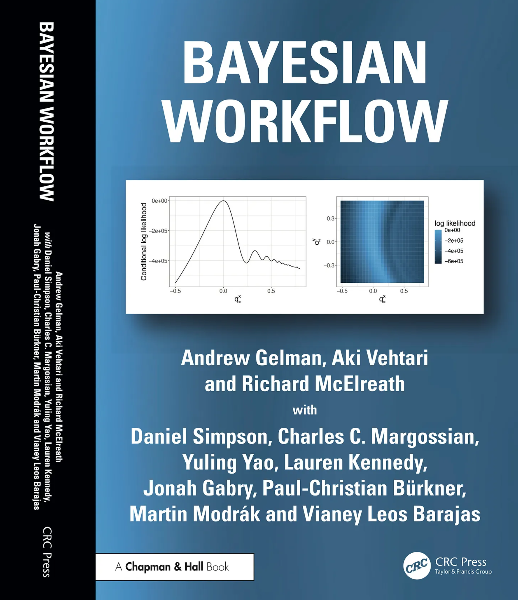
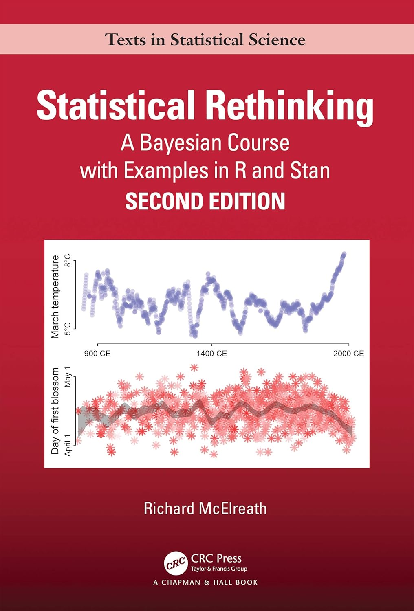
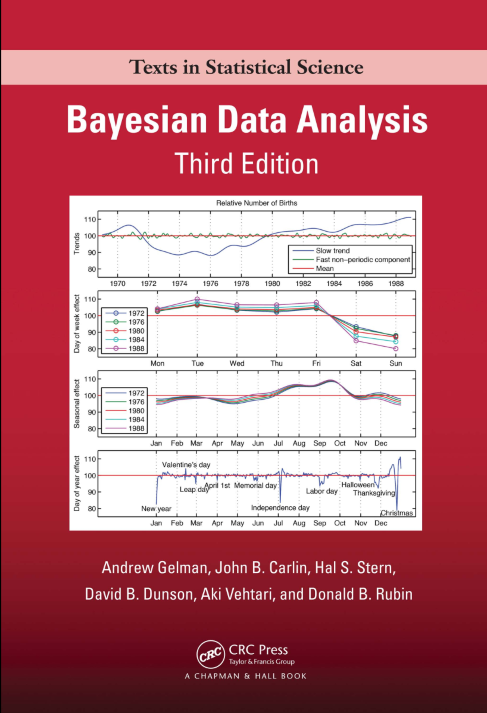
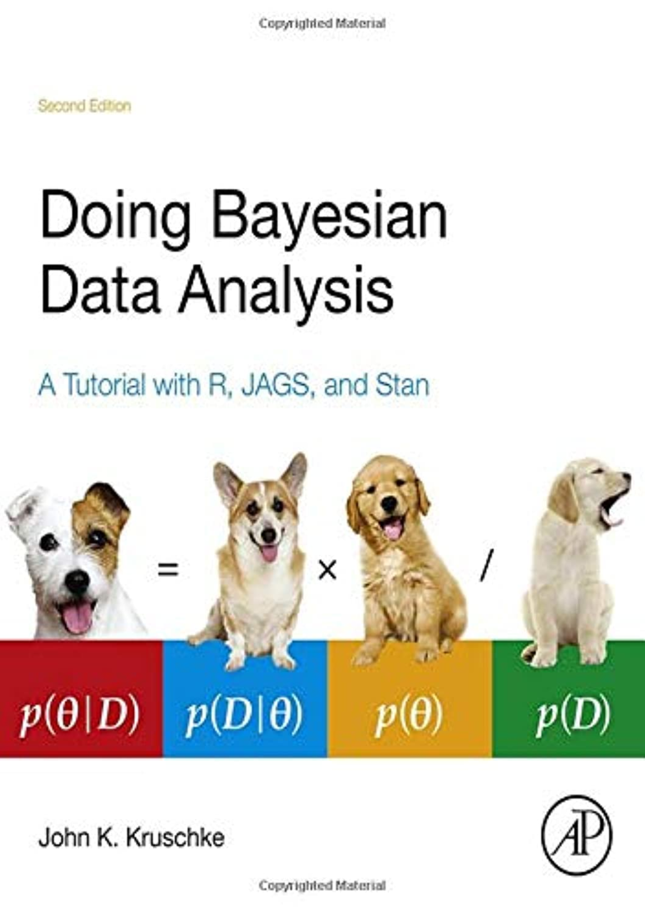
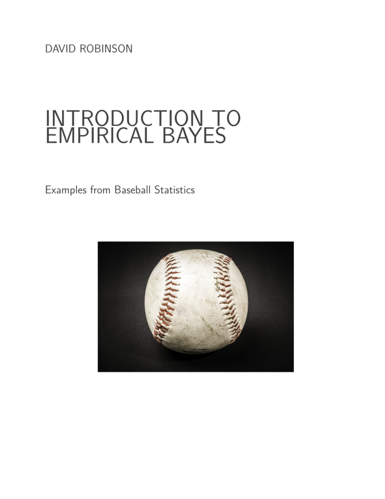
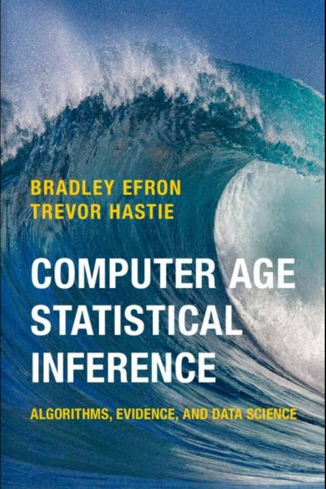

## Мой путь в байесовской статистике

- [@robinson2017]
- Курсы на DataCamp
  - Jim Albert --- Beginning Bayes with R
  - Rasmus Bååth --- Fundamentals of Bayesian Data Analysis in R
  - Alicia Johnson --- Bayesian Modeling with `RJAGS`
  - Jake Thompson --- Bayesian regression modeling with `rstanarm`
- учился на SMLP 2019 у Bruno Nicenboim на Advanced Bayesian analysis
- преподавал на двух байесовских курсах в рамках матсерской АнДана на Летней Школе
- веду курс по анализу данных для лингвистов, в котором с каждым годом все больше байесовской статистики
- в 2026-ом году послушал курсы R. McElreath "Statistical Rethinking"
- ... думаю, он еще не завершен.

## Учебники по байесовской статистике...

... которые я открывал (кроме одной) и могу рекоммендовать. Но их уже тучи: в каждом западном крупном издательстве вышло по две-три.

```{r}
#| echo: false
#| layout-ncol: 3
#| fig-subcap:
#|   - "[@gelman2026]"
#|   - "[@mcelreath2020]"
#|   - "[@gelman2014]"
#|   - "[@kruschke2014]"
#|   - "[@robinson2017]"
#|   - "[@efron2017]"







```

Еще ссылки:

- [Bruno Nicenboim, Daniel J. Schad, and Shravan Vasishth --- Introduction to Bayesian Data Analysis for Cognitive Science](https://bruno.nicenboim.me/bayescogsci/)
- [Kevin Ross --- An Introduction to Bayesian Reasoning and Methods](An Introduction to Bayesian Reasoning and Methods)
- [Alicia A. Johnson, Miles Ott, Mine Dogucu --- Bayes rules!](https://www.bayesrulesbook.com/)
- [Olivier Gimenez --- Bayesian analysis of capture-recapture data with hidden Markov models: Theory and case studies in R and NIMBLE](https://oliviergimenez.github.io/banana-book/index.html)
- [A Solomon Kurz --- Doing Bayesian Data Analysis in brms and the tidyverse](https://solomon.quarto.pub/dbda2/)
- [Jim Albert, Jingchen (Monika) HU --- Probability and Bayesian Modeling](https://bayesball.github.io/BOOK/probability-a-measurement-of-uncertainty.html)
- [A Solomon Kurz --- Statistical Rethinking 2 with brms and the tidyverse](https://solomon.quarto.pub/sr2/)

## Зачем этот спринт?

- расширить комьюнити и найти единомышленников
- найти концептуальные пробелы
- улучшить читаемый курс
